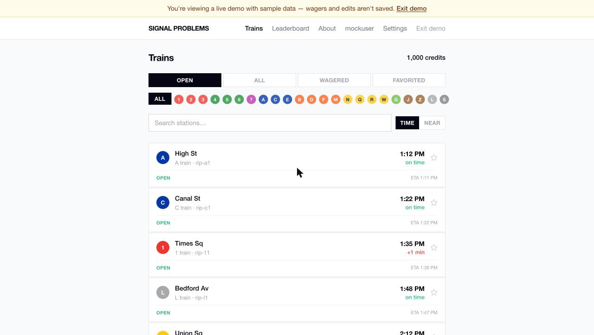
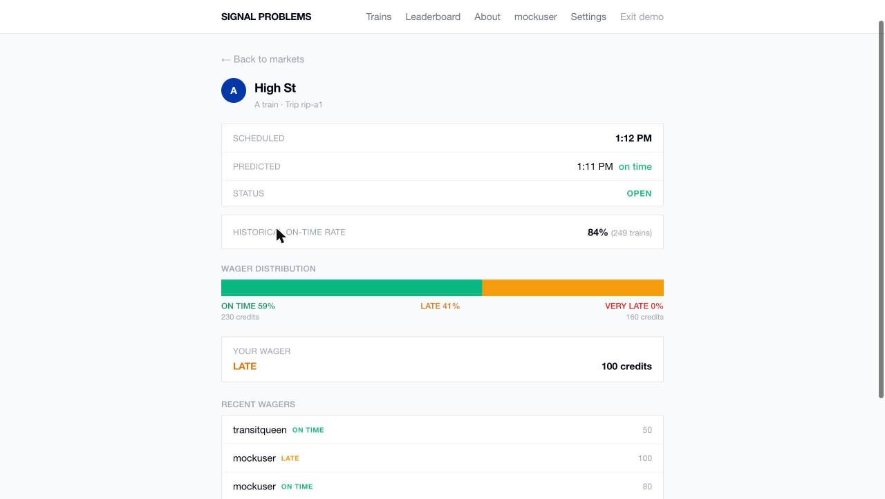
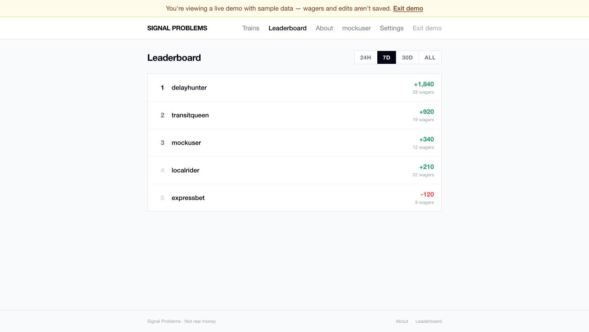

# Signal Problems

A real-time prediction market game for NYC subway delays. Wager credits on whether a train will arrive `on_time`, `late`, or `very_late` — priced from historical on-time rates for that stop and route, fed by live MTA GTFS-Realtime data.

**[Try it live →](https://signal-problems.vercel.app)** — click *"Just looking? Try the live demo"* on the sign-in screen. No account needed; it runs entirely on fixture data.



## Features

- **Three-tier markets** — every train-at-stop prediction prices `on_time` / `late` / `very_late` separately, not a flat coin flip.
- **Dynamic odds** — priced per market from that stop+route's historical on-time rate (with a small vig), locked in at market creation and settled against real arrival data.
- **Live MTA data** — markets are generated from MTA GTFS-Realtime feeds, decoded and ingested on a schedule via a Supabase Edge Function.
- **Profile stats** — ROI by subway line, win rate by time of day, win/loss streaks.
- **Geolocation** — a "nearby trains" view using the browser's location and haversine distance to the closest stations.
- **Favorites & filtering** — favorite stops, filter markets by line or status.
- **Leaderboard** — ranked by net profit over 24h / 7d / 30d / all-time windows.
- **Demo mode** — the whole app runs on realistic fixture data with no backend, so anyone can explore it without signing up.

| Market detail & odds | Leaderboard |
|---|---|
|  |  |

## Tech stack

**Frontend** — React 19, TypeScript, Vite, TanStack Query, React Router v7, Tailwind CSS v3, Radix UI
**Backend** — Supabase (Postgres, Auth, Row Level Security), Deno Edge Functions
**Data** — MTA GTFS-Realtime protobuf feeds, decoded and priced server-side
**Testing** — Vitest + Testing Library

## Quickstart

The fastest way to run this locally is mock mode — no Supabase project or MTA access required:

```sh
npm install
cp .env.example .env
# set VITE_MOCK_MODE=true in .env
npm run dev
```

Open `http://localhost:5173` — you're straight into the app on fixture data.

To run against a real Supabase backend and live MTA data instead, see [SETUP.md](SETUP.md).

## Commands

```sh
npm run dev          # dev server at http://localhost:5173
npm run build         # type-check + production build
npm run lint          # eslint
npm run test          # run the test suite once
npm run test:watch    # watch mode
```

## Architecture

See [CLAUDE.md](CLAUDE.md) for a deeper walkthrough of the data model, the odds/settlement pipeline, and how the edge functions fit together.

## Roadmap

See [ROADMAP.md](ROADMAP.md) for planned features and known gaps.

## License

MIT — see [LICENSE](LICENSE).
